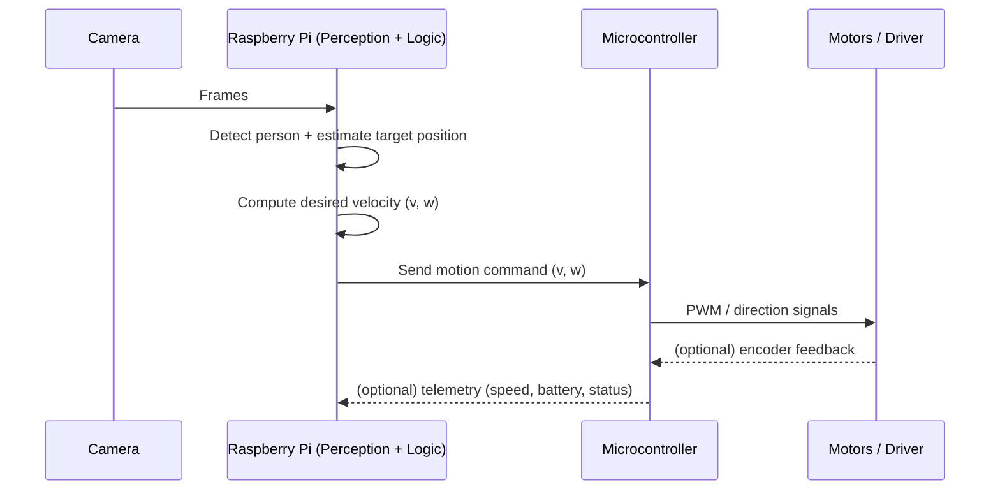

# F.O.C.A. – Robot Inspired by *RObotzi*

## General Description

This project is a physical and functional reinterpretation of **F.O.C.A.**, a character from the Romanian animated series *RObotzi*. The goal is to build a small autonomous mobile robot capable of perceiving its environment, interacting with humans, and moving intelligently in dynamic and unstructured spaces.

Unlike simple educational robots, F.O.C.A. does not rely on predefined paths or line-following. Instead, it uses visual perception to recognize people, follow them autonomously, and avoid obstacles in real time. The robot also features voice output to communicate in a manner inspired by the original character.

The system is designed as a modular robotics platform centered around a Raspberry Pi, combining perception, motion, and interaction into a single cohesive system.

---

## Project Goals

- Recreate the *behavioral essence* of F.O.C.A. from *RObotzi* in a real-world robotic system
- Implement real-time person recognition and tracking
- Enable autonomous navigation with obstacle avoidance
- Provide voice-based interaction inspired by the original character
- Build a fully integrated system, not a tutorial-based assembly

---

## Hardware Overview

### Main Components

- **Raspberry Pi 4** – Main processing unit
- **Raspberry Pi Camera Module** – Visual perception
- **Motorized mobile chassis** – Differential drive platform
- **Motor driver module** – Motor control interface
- **Arduino-compatible microcontroller** – Low-level I/O and audio control
- **Microphone and speaker** – Audio input/output
- **Power supply / battery pack** – System power
- **Cables, mounts, and structural components**

---

## Bill of Materials (BOM)

| Component | Description | Quantity |
|---------|-------------|----------|
| Raspberry Pi 4 | Central compute unit | 1 |
| Raspberry Pi Camera Module | Vision input | 1 |
| Mobile robot chassis | Motors + wheels | 1 |
| Motor driver | DC motor control | 1 |
| Microcontroller board | Peripheral control | 1 |
| Microphone | Audio input | 1 |
| Speaker | Audio output | 1 |
| Battery / Power supply | Portable power | 1 |
| Cables & connectors | Wiring | As needed |

---

## System Architecture

The system is built around a **centralized intelligence model**:

- The Raspberry Pi handles:
  - vision processing
  - person recognition and tracking
  - navigation logic
  - high-level behavior control

- The microcontroller handles:
  - motor actuation
  - audio output
  - real-time I/O operations

This separation allows reliable motor control while keeping computationally intensive tasks on the Raspberry Pi.

---

## Functional Capabilities

- Person detection using the camera module
- Continuous tracking of a selected person
- Dynamic obstacle detection and avoidance
- Autonomous motion control in unknown environments
- Voice output for interaction and feedback

---

## Answers to the Required Questions

### Q1 – What is the system boundary?

The system boundary includes the robot’s onboard hardware (Raspberry Pi, camera, motors, microcontroller, audio components) and its internal software stack. External services are limited to optional voice generation APIs. No external sensing infrastructure is required.

---

### Q2 – Where does intelligence live?

The intelligence of the system resides primarily on the **Raspberry Pi 4**, where perception, decision-making, and behavioral logic are executed. The microcontroller acts as a real-time executor for physical actions.

---

### Q3 – What is the hardest technical problem?

The most challenging aspect is achieving **robust real-time person tracking while navigating complex environments**, combining visual perception, obstacle avoidance, and motor control without predefined paths or markers.

---

### Q4 – What is the minimum demo?

A successful minimum demonstration consists of:
1. Detecting a person using the camera
2. Following that person autonomously
3. Avoiding obstacles during movement
4. Producing voice output in response to events

---

### Q5 – Why is this not just a tutorial?

This project is not based on a step-by-step tutorial. It integrates multiple complex subsystems—vision, autonomous navigation, motion control, and interaction—into a unified robotic platform with original design decisions and behavior inspired by a fictional character.

---

## ESP32 / Microcontroller Requirement

An additional microcontroller (Arduino-compatible) is required for:
- reliable motor control
- real-time audio handling
- offloading low-level I/O from the Raspberry Pi

An ESP32 is optional but not required for the core functionality.

---

# Workflow Diagrams


---

## 1) High-Level Workflow

```mermaid
flowchart TD
  A[Power On] --> B[Initialize Modules]
  B --> C[Camera Stream + Perception]
  C --> D{Person Detected?}
  D -- No --> C
  D -- Yes --> E[Target Lock + Tracking]
  E --> F[Obstacle Check]
  F --> G{Path Clear?}
  G -- Yes --> H[Follow Controller\n(distance + heading)]
  G -- No --> I[Avoidance Maneuver]
  H --> J[Motor Command Output]
  I --> J
  J --> C
```


---

## 2) Perception → Control Loop (Core Autonomy)




---

## 3) Voice Interaction Workflow

```mermaid
flowchart LR
  A[Event Trigger\n(e.g. target found / obstacle / greeting)]
    --> B[Select Phrase / Response]
  B --> C{Voice Source}
  C -- Local audio --> D[Playback]
  C -- Optional voice synthesis API --> E[Fetch audio]
  E --> D
  D --> F[Return to Autonomy Loop]
```


---

## 4) Behavioral State Machine

| State    | Meaning                         | Exit Condition                    |
|----------|---------------------------------|-----------------------------------|
| `SEARCH` | Scanning for a person           | Person detected                   |
| `LOCK`   | Stabilize tracking on target    | Stable tracking for N frames      |
| `FOLLOW` | Maintain distance and heading  | Target lost or obstacle too close |
| `AVOID`  | Obstacle avoidance maneuver     | Path clear and target reacquired  |
| `IDLE`   | Safe stop                       | Start command or person detected  |

